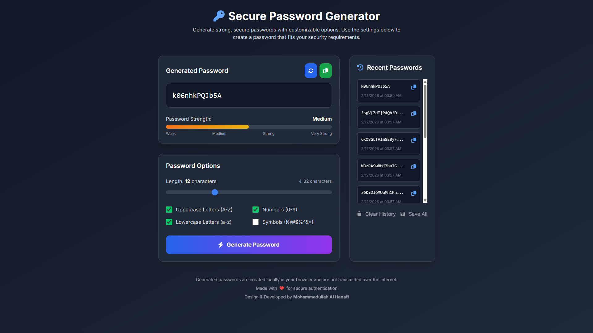

# 🔐 Secure Password Generator — Customizable, Local, Secure

**Secure Password Generator** is a professional, feature-rich web application that creates strong, secure passwords based on user-defined criteria. All password generation happens **locally in your browser** — no passwords are transmitted over the internet, ensuring complete privacy and security.

## ✨ Features

### 🎯 Core Features
- **Customizable Password Length** — 4 to 32 characters with slider control
- **Character Type Selection** — Uppercase (A-Z), Lowercase (a-z), Numbers (0-9), Symbols (!@#$%^&*)
- **Real-time Password Strength Indicator** — Visual bar with 4 levels: Weak, Medium, Strong, Very Strong
- **Copy to Clipboard** — One-click copy with animated confirmation
- **Password History** — Stores last 10 passwords with timestamps (localStorage)
- **Save History** — Export all generated passwords as .txt file
- **Clear History** — Remove all saved passwords with confirmation
- **Refresh/Regenerate** — Generate new password with same settings
- **Client-side Only** — Zero data transmission, complete privacy

### 🎨 UI/UX
- **Tailwind CSS** — Modern, responsive, utility-first styling
- **Dark Theme** — Gradient background from gray-900 to gray-800
- **Glassmorphism Cards** — Rounded-2xl cards with subtle shadows
- **Interactive Elements** — Hover states, transitions, animations
- **Copy Animation** — Pulse effect when copying or refreshing
- **Real-time Updates** — Password regenerates instantly when options change
- **Mobile Responsive** — Grid layout adapts to all screen sizes

### 📊 Password Strength Algorithm

| Score Range | Strength | Bar Width | Color Gradient |
|------------|----------|-----------|----------------|
| 0-3 | Weak | 25% | Red → Orange |
| 4-5 | Medium | 50% | Orange → Yellow |
| 6-7 | Strong | 75% | Yellow → Green |
| 8+ | Very Strong | 100% | Green → Emerald |

**Scoring Factors:**
- Length: +1 at 8, 12, 16, 20 characters
- Uppercase: +1
- Lowercase: +1
- Numbers: +1
- Symbols: +2

## 🛠 Technologies Used

- **HTML5** — Semantic structure
- **Tailwind CSS** — Utility-first CSS framework (CDN)
- **JavaScript (ES6+)** — Password generation logic, localStorage, clipboard API
- **Font Awesome 6** — Icons for UI elements
- **Google Fonts** — Inter (clean, modern sans-serif)
- **LocalStorage API** — Persistent password history
- **Clipboard API** — Copy to clipboard functionality
- **Blob API** — Download password history as .txt file
